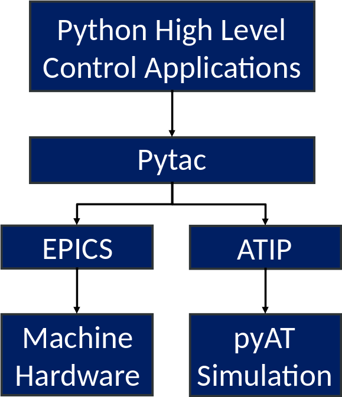

# Overview

ATIP is an addition to [Pytac](<https://github.com/DiamondLightSource/pytac>)
a framework for controlling particle accelerators. ATIP adds a simulator to
Pytac, which can be used and addressed in the same way as a real accelerator.
This enables the easy offline testing of high level accelerator controls
applications.

ATIP is hosted on Github [here](<https://github.com/DiamondLightSource/atip>)

The python implementation of
[Accelerator Toolbox](<https://github.com/atcollab/at>) (pyAT) is used
for the simulation.

:::sidebar

:::

ATIP allows an AT lattice to be fitted into the simulation data source of a
Pytac lattice. This integrated lattice acts like a normal Pytac lattice, and
enables the AT simulator to react and respond to changes as the real
accelerator would.

ATIP also makes use of a [Cothread](<https://github.com/DiamondLightSource/cothread>)
thread to recalculate and update the stored physics data any time a change is
made to the lattice.

ATIP can also be run in a standalone application as a "virtual accelerator",
publishing the same control system interface as the live machine. At Diamond
Light Source this has been implemented with EPICS, using
[PythonSoftIOC](<https://github.com/Araneidae/pythonIoc>)

The diamond virtual accelerator can be found [here](<https://github.com/DiamondLightSource/virtac>)

## Helpful tips:

In order for ATIP to function correctly, the AT and Pytac lattices used must be directly equivalent, i.e. they must have the same length and elements in the same positions.

If local (not pip) installations are used, ATIP, AT, and Pytac must all be located in the same source directory in order for ATIP to function correctly.

The methods on ATIP's data sources that take handle and throw arguments do so only to conform with the Pytac DataSource base class from which they inherit. Inside ATIP they are not used and can be ignored.

To interpret which data is to be returned or set, both ATElementDataSource and ATLatticeDataSource use a dictionary of functions corresponding to fields. In the case where a cell needs to be passed to the data handling functions, for further specification, functools' partial() is used.

The physics data is received from AT all together; to make it easier to manage, it is split by ATIP and accessed by a number of methods of the ATSimulator object. This aims to be more convenient for the user but does result in the ATSimulator object having a large number of methods.

A number of functions that perform tasks that are frequent or long-winded are included in utils.py to make life easier for the user.
